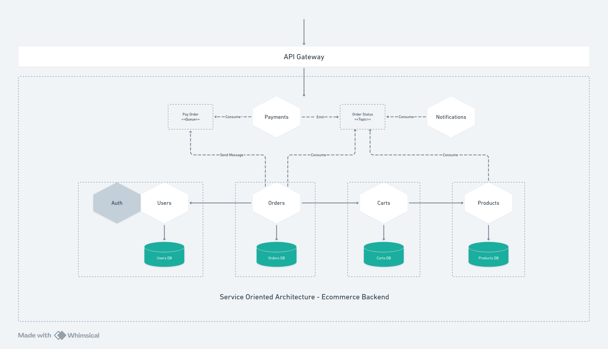
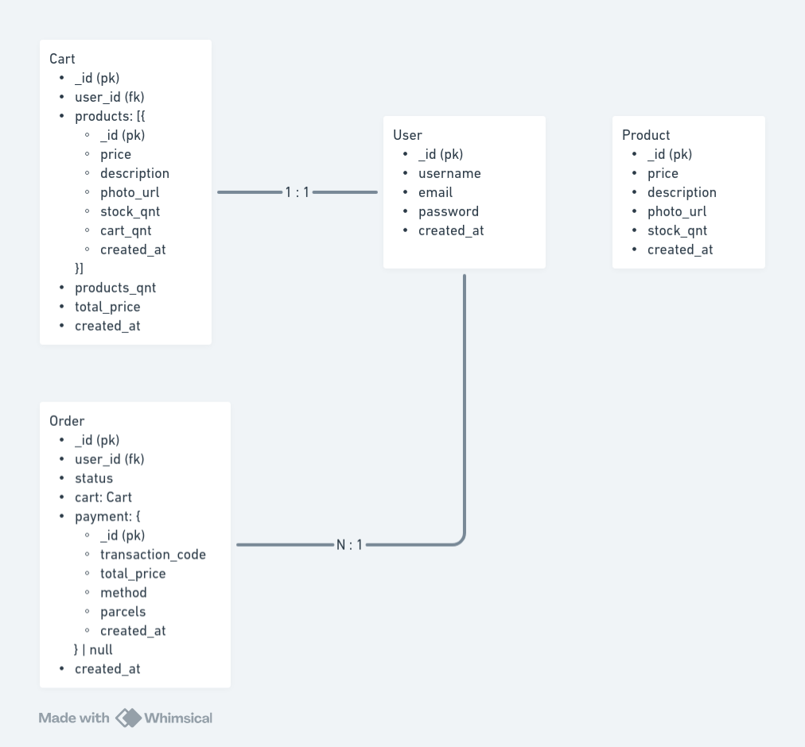

# Ecommerce Backend Soa

Backend for a generic ecommerce, but using service oriented architecture

## Functional Requirements

- Ability for users to sign up and log in.
- Ability to add products to a cart.
- Ability to remove products from a cart.
- Ability to view and search for products.
- Ability for users to checkout and pay for products.
- Admin panel to add products, set the prices and manage inventory

## Non Functional Requirements

- Use asaas as payments gateway
- Use Next.js for build the frontend
- Use server-client architecture
- Use mongodb as database
- Use NodeJS and NestJS for backend

## Entities

- Users
- Products
- Carts
- Orders

## Architecture

## ERD

## Running Locally

To run locally you have to start each service using docker.

I personally recommend you to start the RabbitMQ (just go to rabbit-mq folder and follow the instructions) first and then start the others services.

Don't worry, each service folder has his own documentation, and the instructions to run locally.

I left a postman collection for you to test the endpoints locally, just install the json located in the project's root folder and import it into your postman.
