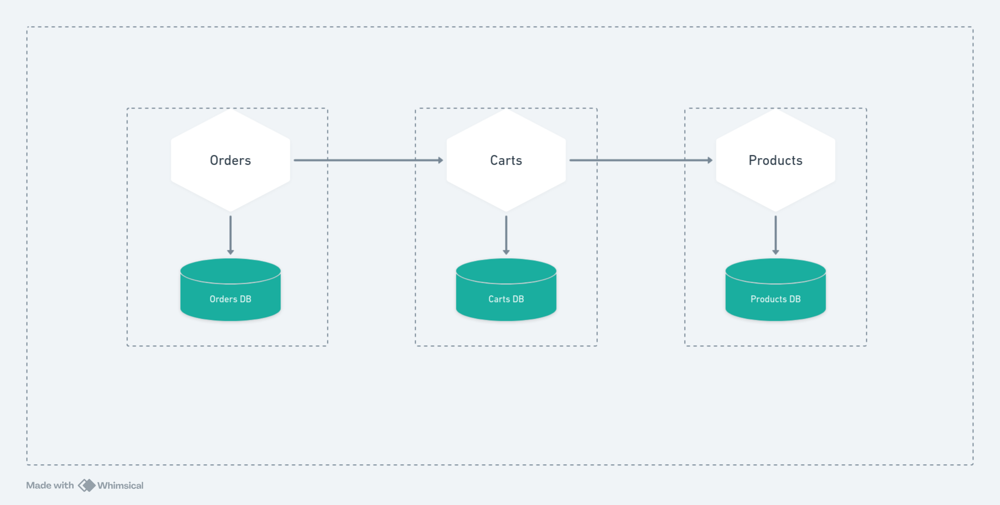

# Service: carts

This service is responsible to manage all user carts of the application.

Each user will have only one cart, and this service will be responsible to manage it.

## API

### Public Functionalities

1. Find current state of authenticated user's cart
2. Remove products from authenticated user's cart
3. Add products to authenticated user's cart
4. Clear authenticated user's cart

### Public endpoints

1. **GET** /carts/my-cart
2. **DELETE** /carts/my-cart/products/:id
3. **POST** /carts/my-cart/products/:id
4. **DELETE** /carts/my-cart

### Private functionalities

1. Find cart by userId
2. Delete cart by id

### Private endpoints

1. **GET** /carts/user/:userId
2. **DELETE** /carts/:cartId

## Dependencies

### Used by

- orders service

### Uses

- products service

### Dependencies Diagram



## Running service using Docker

### 1. Setup .env file

Create a file called .env on project's root folder, and put something like this inside:

```
# Database
DB_URI=mongodb://database:27017
DB_NAME=carts-db
DB_USER=admin
DB_PASSWORD=admin
DB_PORT=27017

# Server
SERVER_PORT=8080
PRODUCTS_SERVICE_URL=http://products-nest-api:8080
```

### 2. Starting the service

Tu run in production mode just go to the project's root folder and run:

```
docker compose up -d
```

### 3. Connect to private network

All the containers will run on the same docker network called **ecommerce-soa**.

If you haven't created it yet just run:

```
docker network create ecommerce-soa
```

If you already done this step, just connect with it

```
docker network connect ecommerce-soa carts-nest-api
```

## Reminder

Of course in a real world situation we don't wanna run all the services in the same machine, that is the opposite of a distribute service oriented architecture, doing that you just increase the project complexity and don't gain the benefits of this architecture.

I'm doing this because I value my money and don't want to owe the value of a house to AWS services.
