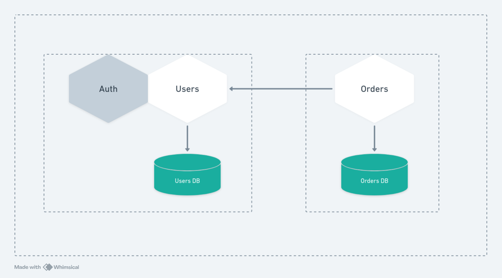

# Service: orders

This service is responsible to manage users and handle authentication.

## API

### Public functionalities

1. Login user
2. Signup user

### Public endpoints

1. **POST** /auth/login
2. **POST** /auth/signup

### Private functionalities

1. Find user by id

### Private endpoints

1. **GET** /users/:userId

## Dependencies

### Used by

- orders service

### Dependencies Diagram



## Running service using Docker

### 1. Setup .env file

Create a file called .env on project's root folder, and put something like this inside:

```
# Database
DB_URI=mongodb://database:27017
DB_NAME=users-db
DB_USER=admin
DB_PASSWORD=admin
DB_PORT=27017

# Server
SERVER_PORT=8080
SERVER_JWT_SECRET=secret
```

### 2. Starting the service

Tu run in production mode just go to the project's root folder and run:

```
docker compose up -d
```

### 3. Connect to private network

All the containers will run on the same docker network called **ecommerce-soa**.

If you haven't created it yet just run:

```
docker network create ecommerce-soa
```

If you already done this step, just connect with it

```
docker network connect ecommerce-soa users-nest-api
```

## Reminder

Of course in a real world situation we don't wanna run all the services in the same machine, that is the opposite of a distribute service oriented architecture, doing that you just increase the project complexity and don't gain the benefits of this architecture.

I'm doing this because I value my money and don't want to owe the value of a house to AWS services.
